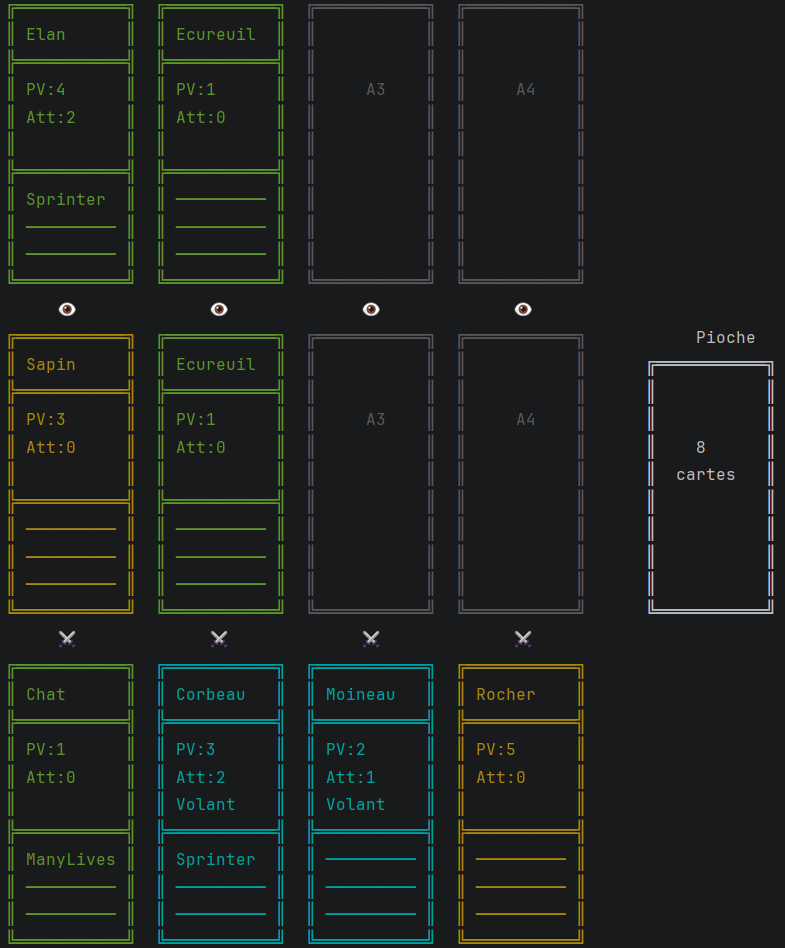
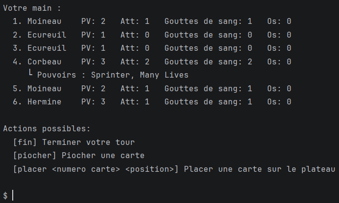
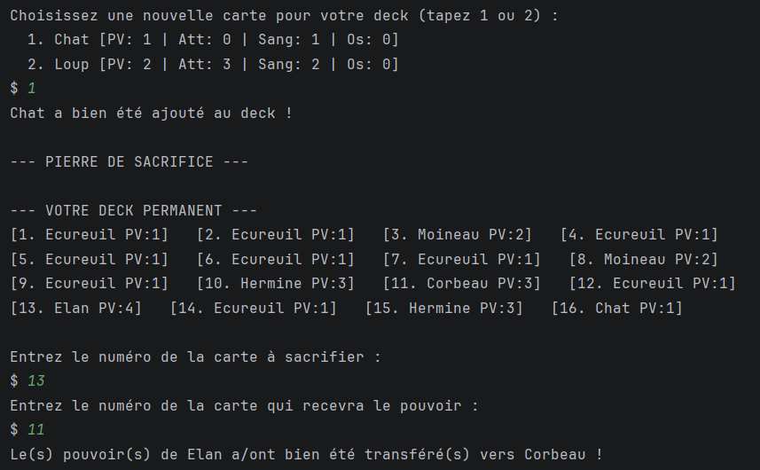

# Inscryption-Projet-IUT

# 🌲 Projet Inscryption - SAE21

Développement du jeu Inscryption en java dans le cadre de la SAE21 du BUT Informatique (IUT Robert Schuman, Université de Strasbourg).

---

## Description

Ce projet est une tentative de réplique du jeu **Inscryption**, en cinq semaines et en équipe de deux. Le joueur peut jouer Trois parties d'**Inscryption** avec entre chaque partie l'ajout d'une carte dansledeck et la méchanique de la pierre de sacrifice pour transmettre les pouvoirs.

---

## 📸 Aperçu

### Plateau de jeu

### Main et actions

### Pierre de sacrifice et nouvelle carte

---

